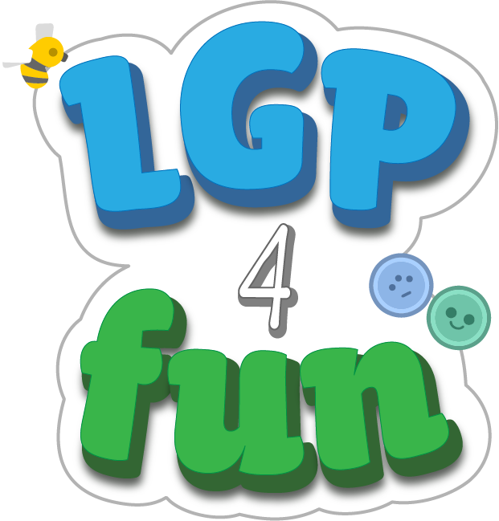

# LGP4Fun - A bilingual classroom educational game for hearing and DHH children

It includes 4 levels and it is connected to the [Contemporary Portuguese Sign Language Dictionary (DCLGP)](https://dclgp.dcitizens.eu/).  

- **Level 0:** Pre-school Alphabet
- **Level 1:** The Alphabet
- **Level 2:** Thematic Vocabulary
- **Level 3:** Missing Letters

